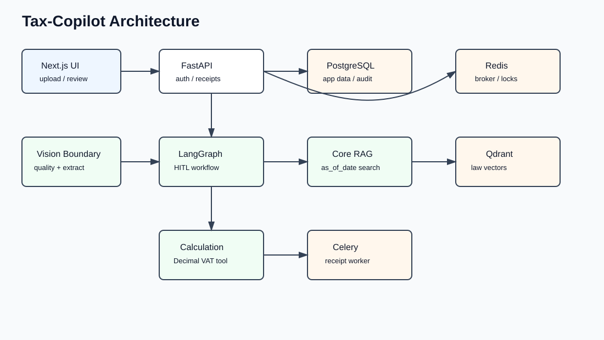
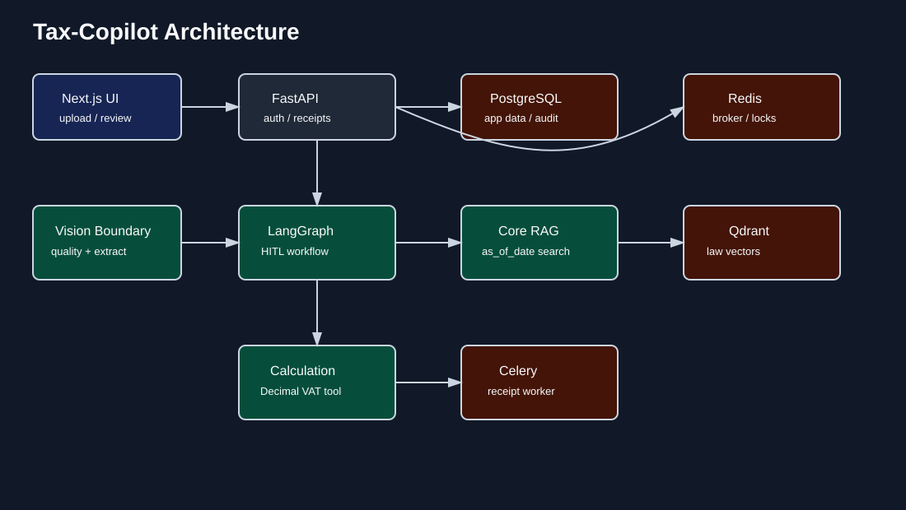

# Tax-Copilot

세무사를 위한 AI 코파일럿. 반복적인 영수증 검토 흐름은 자동화하고, 최종 세무 판단은 세무사가 합니다.

> 본 시스템은 세무사의 업무를 보조하는 도구입니다. AI가 제공하는 분석 결과는 참고용 판단 후보이며, 모든 최종 판단과 세무 신고 책임은 담당 세무사에게 있습니다.

## Status

Work in progress — Phase 6 (Portfolio Polish)

## What It Does

- 영수증 이미지 업로드와 tenant 범위 저장
- PNG/JPEG deterministic image quality check
- Gemini Vision structured extraction 어댑터 경계
- 거래일 기준 세법 RAG 검색
- Python `Decimal` 기반 결정론적 VAT 계산
- LangGraph HITL interrupt/resume
- Celery task dispatch, late ack, idempotency lock
- 감사 로그와 DB status polling

## Architecture





## Key Engineering Decisions

### LangGraph

HITL처럼 실행을 멈추고 외부 입력으로 재개하는 상태 기반 workflow가 필요했다. `audit_prepare_node`와 `human_review_node`를 분리해 resume 시 LLM/DB/external API가 중복 실행되지 않도록 했다.

### Transaction-Date RAG

세무 판단은 현재 법령이 아니라 거래일 당시 시행 법령 기준으로 재현 가능해야 한다. `LawChunk.effective_from/effective_to/corpus_version/content_hash`를 저장하고, `as_of_date`로 검색한다.

### Deterministic Calculation

LLM은 금액을 계산하지 않는다. VAT 분리는 Python의 `Decimal` 로직으로 처리하고, AI 출력은 판단 후보와 근거 제시에만 사용한다.

### Hexagonal Architecture

세무 도메인 로직이 Gemini, Qdrant, Redis, DB 교체에 흔들리지 않도록 `core`와 `infra`를 분리했다. 이 덕분에 Phase 2~5 핵심 로직은 외부 서비스 없이 테스트된다.

### Idempotent Celery

Celery result backend만 믿지 않고 DB receipt status를 사용자 화면의 source of truth로 둔다. task id는 receipt hash와 attempt로 결정론적으로 만들고, Redis-style lock으로 중복 처리를 막는다.

## Stack

- **Backend**: FastAPI, SQLAlchemy 2.0 async, Alembic
- **AI Workflow**: LangGraph
- **RAG**: Qdrant payload adapter + mini law corpus
- **Vision**: deterministic quality check + Gemini adapter boundary
- **Queue**: Celery + Redis lock
- **DB**: PostgreSQL 16
- **Frontend**: Next.js App Router scaffold

## Local Development

```bash
pip-sync requirements/dev.txt
pip install -e .
pytest
ruff check .
mypy src tests
```

Optional services:

```bash
docker compose up -d
alembic upgrade head
uvicorn tax_copilot.api.main:app --reload
celery -A tax_copilot.workers.celery_app.celery_app worker -l info
```

## Verification

Current local check:

```text
pytest: 28 passed
ruff: passed
mypy: passed
```

## Roadmap

- Live Gemini Vision extraction
- law.go.kr collector and full corpus embedding
- PostgreSQL LangGraph checkpointer setup script
- Admin retry button and deployment hardening
- Demo GIF after UI/backend live integration
