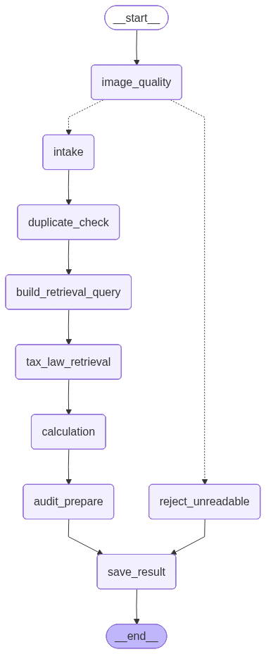

# LangGraph 워크플로우

Tax-Copilot의 영수증 처리 파이프라인은 LangGraph로 구현된 6노드 DAG이다.

## 그래프 구조



## 노드 설명

| 노드 | 역할 |
|---|---|
| `image_quality` | 업로드된 이미지의 해상도·형식·크기를 Pillow로 검사. 기준 미달 시 `reject_unreadable`로 분기 |
| `reject_unreadable` | 판독 불가 판정 후 오류 상태로 `save_result`에 전달 |
| `intake` | Gemini Vision으로 영수증 OCR. `ParsedReceipt` 스키마(날짜·금액·공급처·부가세)로 변환 |
| `duplicate_check` | 파일 해시 기반 중복 감지. Redis 락으로 동시 처리 방지 |
| `build_retrieval_query` | 파싱 결과를 기반으로 법령 검색 쿼리 생성 |
| `tax_law_retrieval` | Qdrant 벡터 DB에서 관련 세법 조항 RAG 검색 |
| `calculation` | 공급가액·부가세·합계 계산 |
| `audit_prepare` | 리스크 플래그 평가 후 HITL 필요 여부 결정. `NEEDS_REVIEW` 또는 `APPROVED` |
| `save_result` | 최종 상태를 PostgreSQL에 저장 |

## 실행 흐름

```
__start__
    └─► image_quality
            ├─► (화질 통과) intake ─► duplicate_check ─► build_retrieval_query
            │                                                       └─► tax_law_retrieval
            │                                                                   └─► calculation
            │                                                                           └─► audit_prepare
            │                                                                                   └─► save_result ─► __end__
            └─► (화질 실패) reject_unreadable ─────────────────────────────────────────────────► save_result
```

## HITL 연계

`audit_prepare` 노드가 `requires_human_review=True`로 판단하면 상태가 `NEEDS_REVIEW`로 저장된다. 세무사는 `PATCH /api/v1/reviews/{receipt_id}/decide`로 승인(`APPROVED`) 또는 반려(`REJECTED`)한다. LangGraph Checkpointer(PostgreSQL)가 스레드 상태를 보존하므로 재개가 가능하다.
